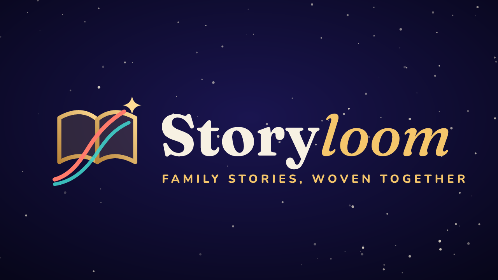
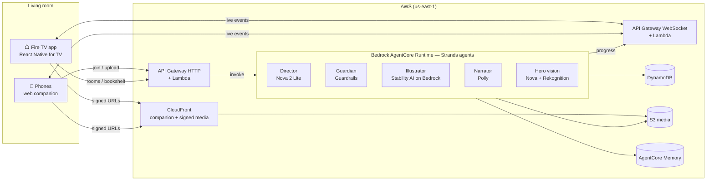

<p align="center">
  
</p>

<h3 align="center">Family stories, woven together — on Fire TV.</h3>

<p align="center">
  <b>Fire TV track</b> · AWS Builder · Open Source &nbsp;|&nbsp; React Native for TV · Amazon Bedrock AgentCore · Strands Agents · Amazon Nova · Stability AI on Bedrock · Polly
</p>

---

## What is Storyloom?

Storyloom turns the TV into a place where a family **makes** a story together instead of just watching one.

1. **Everyone joins from their phone** — scan the QR code on the TV. No app, no account.
2. **A child draws a hero on paper** and snaps it. On the TV, the drawing *comes alive* as a picture-book illustration that keeps the child's own lines.
3. **Someone says where it happens** ("a lighthouse on the moon") and someone adds a twist.
4. **Storyloom weaves an original illustrated, narrated story** in under a minute.
5. **Words light up as they're read** (read-along builds early literacy), and at the big moment **the family votes** — on their phones or with the Fire TV remote — for what happens next.
6. The story is saved to the **family bookshelf**, and the story world **remembers** its characters next time.

Built for the living room: a 10-foot UI designed for the D-pad, a phone as a second screen, and the TV remote, voice and camera all working in one flow.

> 🎬 **Demo video:** _coming soon_ · 📺 Runs on Fire OS (Fire TV Stick / Android TV emulator)

## Why it matters

- **Screen time that creates.** Parents want kids to be active, not passive, in front of the TV. Storyloom makes the TV a creative, social activity for the whole family.
- **Literacy.** Word-by-word read-along with a warm narrator, adapted to age (3–5, 6–8, 9–11).
- **Safe by design.** Every idea and every word passes Amazon Bedrock Guardrails; photos of real people are rejected; drawings auto-delete in 24 hours; a parent PIN guards settings.
- **Zero copyright risk.** Every story, picture and voice is generated fresh for that family.

## Features

| On the TV (Fire OS) | On the phone (web, no install) | In the cloud (AWS) |
|---|---|---|
| Cinematic home with family bookshelf | Join by QR or 4-letter code | Multi-agent story engine on **AgentCore Runtime** |
| Story Studio with live "threads" from each person | Snap a drawing → hero comes alive | **Nova 2 Lite** director with structured output |
| Weaving animation with live progress | Speak or type the world and the twist | **Stability AI on Bedrock**: Control Sketch brings the drawing to life, Style Guide keeps every page in the hero's style |
| Read-along player: Ken Burns art + karaoke text | Vote at the story's fork | **Polly** generative narration + read-along timing |
| Family vote at the fork (phones + remote) | Mini remote (turn pages from the sofa) | **Bedrock Guardrails** on every input and output |
| Bedtime mode, sleep timer, daily limits, parent PIN | Privacy: EXIF stripped, 24h deletion | **AgentCore Memory** — the family's story world |
| Works offline in demo mode | | Rekognition screen, CloudFront signed URLs, WebSockets |

## Architecture



More detail in [docs/ARCHITECTURE.md](docs/ARCHITECTURE.md).

## Repository layout

```
apps/tv          Fire TV app (Expo + react-native-tvos, spatial navigation, read-along player)
apps/companion   Phone web companion (React + Vite)
packages/protocol  Shared types for realtime events and data
services/api     Lambda handlers: HTTP API + WebSocket (TypeScript)
services/agent   Story engine: Strands agents on AgentCore Runtime (Python)
infra            AWS CDK app — everything above, as code
docs             Architecture, friction log, product feedback, brand
```

## Run it

### Prerequisites
Node 20+, Java 17, Android SDK with an **Android TV** system image (API 30 matches Fire OS 8), Python 3.12+ with `uv` (only to deploy the agent), AWS CLI configured (only to deploy).

### 1. TV app on the Fire TV / Android TV emulator
```bash
cd apps/tv
npm install
npm run android        # builds, installs and starts on the running emulator or a connected Fire TV
```
Without a backend configured, the app runs in **offline demo mode** with the bundled bookshelf, so every screen can be explored with the remote. On a real Fire TV: enable *ADB debugging*, then `adb connect <fire-tv-ip>:5555` before `npm run android`.

### 2. Deploy the cloud
```bash
cd infra
npm install
npx cdk bootstrap                       # once per account/region
npm run deploy -- -c alertEmail=you@example.com
```
Then copy the `ApiUrl`, `RealtimeUrl` and `CompanionUrl` outputs into `apps/tv/app.json → expo.extra` and rebuild the TV app.

### 3. Phone companion (local dev)
```bash
cd apps/companion
npm install
npm run dev            # preview mode simulates the TV when no API is configured
```

## Security & privacy

- **No secrets in the apps.** The TV gets a device token; phones get a 6-hour token scoped to one room.
- **Kid-safe content.** Bedrock Guardrails (content filters, denied topics, profanity, PII blocking) on every idea, name and story page, with a Director ↔ Guardian rewrite loop.
- **Photos.** Re-encoded on the phone (strips GPS/EXIF), size- and type-limited by a presigned S3 POST, screened by Rekognition (no real people), deleted after 24 hours by an S3 lifecycle rule.
- **Private media.** All pictures and audio are served through CloudFront **signed URLs**; the signing key is generated inside AWS and never leaves Secrets Manager.
- **Abuse limits.** Room codes expire, joins are rate-limited per IP, and each household has a daily story quota.
- **Delete everything** from the TV's Parents area removes the household, stories and media.

## Team

- **Bapan Ghosh** — product, backend, AI engine and cloud infrastructure
- **Jayashree Mondal** — frontend and UI design

## License

[MIT](LICENSE)
