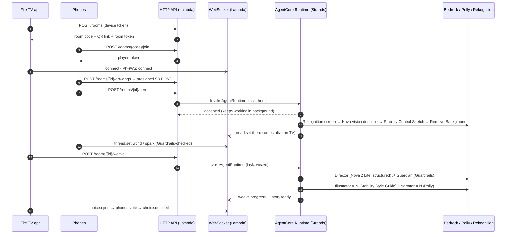

# Storyloom architecture

Storyloom has three parts: the **Fire TV app** (the stage), a **phone companion** (the family's hands and voices)
and an **AWS backend** whose heart is a multi-agent story engine on **Amazon Bedrock AgentCore Runtime**.
Everything in AWS is defined in one CDK app (`infra/`).

## 1. The flow of one story

## 2. Story engine (services/agent)

A Strands multi-agent workflow on AgentCore Runtime (Python 3.13, direct code deployment, arm64):

| Agent / worker | Model / service | Job |
|---|---|---|
| **Hero vision** | Nova 2 Lite (multimodal) + Rekognition | Rejects unsafe photos and photos of real people; describes the child's character faithfully as structured output (`HeroSheet`) |
| **Director** | Nova 2 Lite with Strands structured output (`StoryPlan`) | Weaves every family member's thread into one story with a real fork (branch A/B) and a shared ending; age and mood aware; recalls family memory |
| **Guardian** | Bedrock Guardrails `ApplyGuardrail` | Checks every title, choice and page. Flagged passages go back to the Director to be rewritten (up to 3 passes), otherwise the story fails closed |
| **Illustrator** | Stability AI on Bedrock | Paints the hero portrait from the child's drawing with **Control Sketch** (their lines are kept) or from text with **Stable Image Core**, then every page, choice card and cover with **Style Guide** using the portrait as the style reference, so the book shares one look; one art style + seed per story; **Remove Background** makes the hero cut-out |
| **Narrator** | Polly generative voices | Synthesises sentence by sentence and measures each MP3 exactly to produce word timings for read-along (generative voices don't return speech marks) |
| **Curator** | DynamoDB, S3, AgentCore Memory | Saves the story and bookshelf entry, and records what happened so the family's story world grows |

**Async pattern:** `InvokeAgentRuntime` returns in milliseconds. The entrypoint registers the work with
`app.add_async_task(...)`, so AgentCore keeps the session alive (*HealthyBusy*) until it calls
`complete_async_task`. Meanwhile progress streams straight to the room over the WebSocket management API.

Illustrations and narration run concurrently in a thread pool (6 workers), with adaptive retries for
throttling. A 6-page story with a fork is about 10 illustrations, 7 narrated pages and a cover.

## 3. Data model (single DynamoDB table)

| pk | sk | What |
|---|---|---|
| `HH#{household}` | `META` | Household + parent settings + daily quota |
| `HH#{household}` | `STORY#{createdAt}#{id}` | Bookshelf entry (summary, cover key) |
| `HH#{household}` | `CHAR#{id}` | A hero the family created |
| `STORY#{id}` | `META` | Full story: pages, branches, media keys, word timings |
| `ROOM#{room}` | `META` | Live Story Studio room (TTL 6 h) |
| `ROOM#{room}` | `CONN#{connection}` | Sockets in the room |
| `CODE#{code}` | `CODE` | 4-letter join code (TTL) |
| `CONN#{connection}` | `CONN` | Socket → room/role |
| `RATE#{scope}#{ip}` | `W#{window}` | Fixed-window rate limit counter (TTL) |

## 4. Security model

- **Tokens:** HS256 JWTs signed with a Secrets Manager key. `device` (a TV/household), `tv` (the TV in one
  room, 6 h), `player` (a phone in one room, 6 h). Every handler checks the token type and the room.
- **Uploads:** presigned **POST** with `content-length-range` and `Content-Type` conditions; the key must be
  inside the room's prefix; the photo is re-encoded client-side (EXIF/GPS stripped).
- **Media:** private bucket, CloudFront Origin Access Control, **signed URLs** (12 h). The RSA key pair is
  generated by a custom resource *inside AWS*; the private key only exists in Secrets Manager.
- **Content:** Guardrails on join names, hero names, world and spark ideas (input) and all story text
  (output). Stability AI's built-in content filter on images. Rekognition moderation and person detection on photos.
- **Abuse & cost:** per-IP join rate limits, room/code TTLs, 8 players per room, 12 stories per household
  per day, API Gateway throttling, an AWS Budget with email alerts.
- **Least privilege:** the agent role can only call Nova models, one guardrail, Polly, Rekognition, its own
  table, bucket, memory and WebSocket API.

## 5. Fire TV app (apps/tv)

- Expo SDK 54 + `react-native-tvos` 0.81 (the stack Amazon's multi-TV sample uses), Fire OS build via
  Android Gradle; `LEANBACK_LAUNCHER` + TV banner, touchscreen not required, microphone permission removed.
- Focus: `react-tv-space-navigation` with Fire TV remote key codes forwarded from `MainActivity`
  (config plugin) and Back handled through a small back-stack so dialogs close before screens.
- 10-foot design system: 1920×1080 design grid scaled to any screen, 5% title-safe margins, gold focus
  ring + halo with spring motion, minimum 22 px text at 1080p.
- Player: Ken Burns art, cross-fades, read-along driven by speech-mark timings (or an estimated reading
  clock offline), auto page turns, family voting overlay, "The End" credits.
- Offline demo mode: with no backend configured the whole app works on bundled stories.
